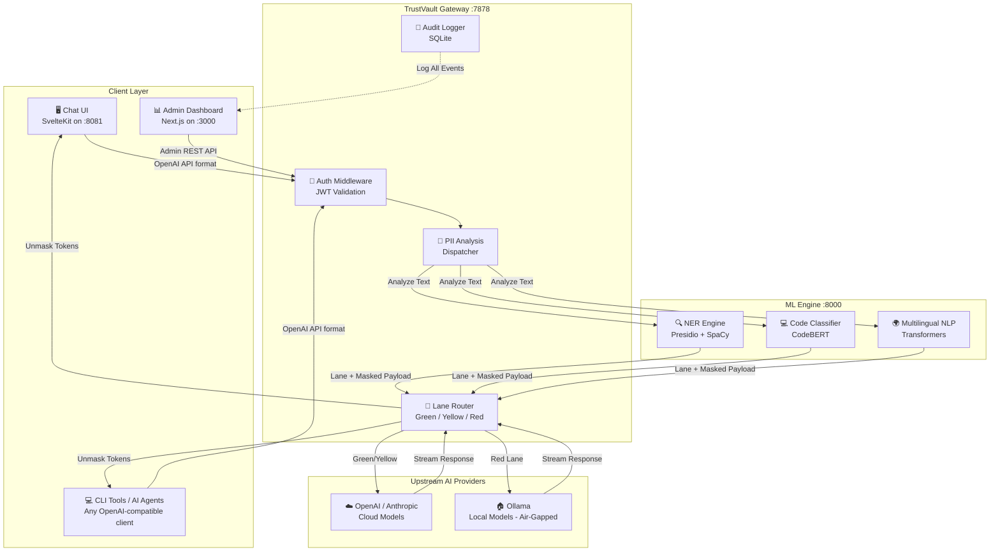
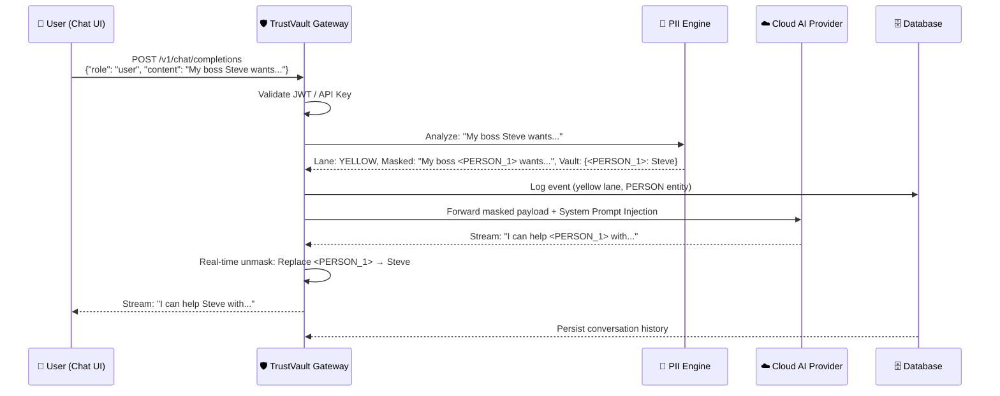

> **⚠️ Note**
> This is not the main project repository — the actual codebase is private. This repo is here to document what was built: the architecture, features, design decisions, and tech stack.

---

<div align="center">

<h1>🛡️ TrustVault</h1>
<p><strong>AI Security Gateway — Zero-Trust Proxy for LLM Traffic</strong></p>

[]()
[]()
[]()
[]()

</div>

---

## 📋 Table of Contents

- [Overview](#-overview)
- [Problem Statement](#-problem-statement)
- [Motivation](#-motivation)
- [Key Features](#-key-features)
- [Technology Stack](#-technology-stack)
- [High-Level Architecture](#-high-level-architecture)
- [Project Workflow](#-project-workflow)
- [Design Decisions](#-design-decisions)
- [Scalability Considerations](#-scalability-considerations)
- [Security Considerations](#-security-considerations)
- [Screenshots](#-screenshots)
- [Demo](#-demo)
- [Repository Structure](#-repository-structure)
- [Future Improvements](#-future-improvements)
- [Contact](#-contact)

---

## 🌐 Overview

**TrustVault** is an enterprise-grade AI Security Gateway that enforces a Zero-Trust boundary between corporate employees and third-party Large Language Models (LLMs) such as OpenAI GPT, Anthropic Claude, and Google Gemini.

It operates as a transparent, OpenAI-compatible API proxy. Any application — whether a web app, CLI tool, or autonomous AI agent — can be routed through TrustVault with a single environment variable change. From that moment, TrustVault silently intercepts, analyzes, and governs every AI prompt before it crosses the corporate network perimeter.

---

## 🎯 Problem Statement

Modern enterprises are rapidly adopting AI assistants to boost developer and employee productivity. However, this adoption has introduced a dangerous and poorly understood attack surface:

> **Employees routinely paste sensitive corporate data into public AI services without realizing it.**

The leaked data includes:
- **Personally Identifiable Information (PII):** Customer names, emails, phone numbers, SSNs.
- **Infrastructure Secrets:** Hardcoded API keys, database connection strings, JWT tokens.
- **Proprietary Intellectual Property:** Internal algorithms, business logic, unreleased product code.

Traditional Data Loss Prevention (DLP) tools are not designed for conversational AI interfaces, creating a massive blind spot in corporate security posture.

---

## 💡 Motivation

The market for AI Security is one of the fastest growing sectors in cybersecurity. Enterprises are actively seeking solutions that allow them to leverage the power of frontier AI models while maintaining regulatory compliance (GDPR, HIPAA, SOC 2) and protecting trade secrets.

TrustVault was designed around one core principle:

> **Security must be invisible. Productivity must be uninterrupted.**

The system masks sensitive data before it leaves the network and restores it in the AI's response — so employees experience zero friction while security teams gain complete observability.

---

## ✨ Key Features

### 🚦 Three-Lane Intelligent Routing
Every prompt is classified and routed through one of three lanes:
| Lane | Classification | Action |
|------|---------------|--------|
| 🟢 **Green** | No sensitive data detected | Forwarded directly to the cloud AI provider |
| 🟡 **Yellow** | PII detected (names, emails, locations) | Data is pseudonymized, sent to cloud, and de-anonymized on return |
| 🔴 **Red** | Proprietary code or secrets detected | Request is blocked or rerouted exclusively to a local, air-gapped AI model |

**Why:** This tiered approach balances security with usability, allowing clean traffic to flow freely while enforcing strict controls on sensitive payloads.

### 🎭 Real-Time PII Pseudonymization
Sensitive entities (names, emails, phone numbers, locations, organizations) are replaced with semantic placeholder tokens (e.g., `<PERSON_1>`, `<EMAIL_ADDRESS_1>`) before leaving the corporate network.

**Why:** The cloud AI never sees the real data, yet can still provide contextually accurate, useful responses.

### 🔒 Proprietary Code Detection
An ML classifier analyzes submitted code segments to determine their confidentiality score. Highly proprietary code is routed to the Red Lane regardless of the presence of PII.

**Why:** Prevents competitors from ever having access to a company's core intellectual property through AI providers' training pipelines.

### 🌊 On-the-Fly Response Unmasking
When the AI provider streams its response back, the gateway intercepts the real-time data stream and replaces placeholder tokens with the original data before it reaches the user's screen.

**Why:** Provides a seamless, natural user experience. The user sees real names and details in the AI's response without ever knowing a masking layer existed.

### 🔑 Centralized API Key Vault
All upstream AI provider API keys are encrypted at rest and managed centrally by administrators. Employees never handle raw provider credentials.

**Why:** Eliminates "API key sprawl" — the dangerous practice of developers storing raw API keys in environment files, Slack messages, or hardcoded in source code.

### 📊 Real-Time Security Analytics Dashboard
A comprehensive admin dashboard provides live visualization of request lane distribution, flagged entity types, model usage trends, and per-user activity.

**Why:** Gives security teams the observability they need to demonstrate compliance and identify high-risk users or departments.

### 🔐 JWT-Based Authentication with Handoff Tokens
Users authenticate to the enterprise dashboard and are issued cryptographically signed session tokens. A one-time handoff token mechanism enables secure, seamless single-click access from the dashboard to the AI chat interface.

**Why:** Eliminates the need for separate credentials, ensuring all AI usage is attributable to a specific corporate identity.

### 🌍 Multi-Model, Multi-Provider Routing
The gateway can dynamically route requests to OpenAI, Anthropic, Google Gemini, or a local Ollama instance based on the detected sensitivity lane and the requested model name.

**Why:** Ensures that even when cloud providers are unavailable for sensitive data (Red Lane), employees can still receive AI assistance from a safe, on-premise model.

---

## 🛠️ Technology Stack

| Layer | Technology | Purpose |
|-------|-----------|---------|
| **API Gateway** | Go (Golang) | High-concurrency, zero-overhead HTTP/SSE proxy |
| **PII Analysis Engine** | Python 3.12 + FastAPI | Asynchronous ML inference serving |
| **NLP / NER** | Microsoft Presidio + SpaCy (`en_core_web_lg`) | Named Entity Recognition for PII detection |
| **Code Classifier** | PyTorch + CodeBERT | Semantic analysis of code confidentiality |
| **Multilingual NLP** | Hugging Face Transformers | Hindi/multilingual PII detection |
| **Admin Dashboard** | Next.js 14 + Tailwind CSS | Real-time data visualization and administration |
| **Chat Interface** | SvelteKit (Open WebUI fork) | End-user AI chat experience |
| **Database** | SQLite (via CGO) | Embedded, zero-setup relational data store |
| **Containerization** | Docker + Docker Compose | Portable, reproducible deployment |
| **CI/CD** | GitHub Actions + GHCR | Automated multi-image build and publish pipeline |

### Why These Choices?

**Go for the Proxy:** Go's goroutine model handles thousands of simultaneous Server-Sent Event (SSE) streaming connections with microsecond overhead. Python or Node.js would require 10x the memory for the same concurrency.

**Python for ML:** Python is the sole host of the ML ecosystem (PyTorch, Hugging Face, SpaCy). Offloading ML to a separate service avoids Python's GIL affecting gateway throughput.

**SQLite (not Postgres):** For MVP deployment, SQLite enables a zero-dependency, single-file database that works identically across every developer machine and Docker environment. Migration to Postgres is a one-step future change.

---

## 🏗️ High-Level Architecture



---

## 🔄 Project Workflow



---

## 🧩 Design Decisions

### 1. Microservice Split: Go Proxy + Python ML Engine
The gateway and the ML analysis service are deployed as independent containers. This architectural split is the single most important design decision in the system.

**Justification:** Go handles high-concurrency I/O (network proxying, SSE streaming) with near-zero overhead. Python is the only viable language for ML inference. Combining them in a single monolith would mean Python's Global Interpreter Lock would starve Go's networking threads, causing catastrophic performance degradation under load.

### 2. Fail-Open Security Model
If the PII engine becomes temporarily unavailable (e.g., during a cold start or heavy load), the gateway defaults to Green Lane (forwarding traffic), not blocking it.

**Justification:** In an enterprise context, blocking all AI traffic during an engine restart would immediately trigger support escalations and erode trust in the system. The logging system records all fail-open events so security teams can audit them.

### 3. Pseudonymization Over Redaction
Sensitive tokens are replaced with semantic placeholders (`<PERSON_1>`) rather than being stripped entirely.

**Justification:** Redacting data would render many prompts nonsensical, breaking the AI's ability to provide useful responses. Pseudonymization preserves the semantic structure of the prompt, allowing the AI to reason accurately while remaining blind to the real identity.

### 4. System Prompt Injection on Yellow Lane
When a prompt is pseudonymized, a hidden system instruction is prepended telling the AI to preserve placeholder tokens verbatim.

**Justification:** Without this instruction, frontier LLMs may attempt to "fill in the blanks" and hallucinate realistic-sounding names or emails, which would leak synthetic but convincing PII back to the user.

### 5. Deduplication Window for Log Entries
Open WebUI generates multiple background API calls per user prompt (title generation, tag suggestion, follow-up questions). The gateway applies a 2-second deduplication window to prevent a single user interaction from producing dozens of log entries.

**Justification:** Without deduplication, the audit log would be flooded with noise, making it impossible for security teams to identify genuine DLP events.

---

## 📈 Scalability Considerations

| Concern | Current State | Production Path |
|---------|--------------|----------------|
| **Internal Communication** | REST over HTTP between Go and Python | Upgrade to gRPC for ~5x throughput |
| **Database** | Single-file SQLite | Migrate to PostgreSQL with connection pooling |
| **PII Engine** | Single Python container | Horizontal scaling with load balancer |
| **Authentication** | JWT with local user store | Integrate Okta / Microsoft Entra (SAML/SSO) |
| **Observability** | SQLite audit logs | Export to Elasticsearch / Datadog |

---

## 🔐 Security Considerations

- All upstream AI provider credentials are **encrypted at rest** using AES-GCM with a system-managed key. Raw API keys are never stored in plaintext.
- All inter-service communication within the Docker network is isolated and not exposed to the host.
- JWT tokens are short-lived and cryptographically signed. One-time handoff tokens for Chat UI login expire after a single use.
- The gateway enforces strict CORS headers and sanitizes all forwarded headers to prevent header injection attacks.
- The Red Lane provides a fully **air-gapped fallback**: when sensitive code is detected, traffic can be routed exclusively to a local Ollama instance that has no external network connectivity.
- All proxied requests are logged with user identity, timestamp, lane classification, and detected entity types for forensic auditability.

---

## 📸 Screenshots

> [TODO: Add dashboard screenshot — Live Logs view]

> [TODO: Add dashboard screenshot — Analytics / Lane Distribution chart]

> [TODO: Add Chat UI screenshot showing seamless interaction]

> [TODO: Add Admin Keys management screenshot]

---

## 🎬 Demo

> [TODO: Add animated GIF or video walkthrough of a Yellow Lane masking event]

A typical demonstration flow:
1. User opens Chat UI and types a prompt containing a colleague's name and email.
2. The Dashboard's Live Logs view instantly shows a 🟡 Yellow Lane event with the detected `PERSON` and `EMAIL_ADDRESS` entities.
3. The user receives a perfectly accurate AI response — with their colleague's real name naturally appearing in the text.
4. The Cloud AI provider received the fully anonymized version of the message.

---

## 📁 Repository Structure

```
trustvault-showcase/
├── README.md                   ← You are here
├── LICENSE                     ← MIT License
├── .gitignore
├── docs/
│   ├── architecture.md         ← Detailed system architecture
│   ├── system-design.md        ← Low-level design decisions
│   ├── tech-stack.md           ← Technology justifications
│   ├── features.md             ← Feature specifications
│   ├── roadmap.md              ← Future development plan
│   ├── limitations.md          ← Known limitations and trade-offs
│   └── screenshots/            ← UI screenshots (TODO)
├── diagrams/
│   ├── architecture.png        ← System architecture diagram (TODO)
│   ├── workflow.png            ← Request flow diagram (TODO)
│   └── component-diagram.png  ← Component interaction diagram (TODO)
└── assets/
    ├── logo.png               ← Project logo (TODO)
    └── demo.gif               ← Demo animation (TODO)
```

---

## 🗺️ Future Improvements

1. **gRPC Internal Transport** — Replace HTTP between the Go proxy and Python engine with a binary, compressed gRPC protocol for sub-millisecond internal latency.
2. **SSO / SAML Integration** — Enterprise login via Okta, Google Workspace, or Microsoft Entra ID, eliminating local password management.
3. **Token Economics & Cost Tracking** — Real-time tracking of input/output token consumption per user and department, with cost estimation across different model providers.
4. **Custom Rules Engine** — A dashboard page where admins define custom regex patterns or keywords (e.g., internal project codenames) that always trigger the Red Lane.
5. **Multi-Modal DLP (File Scanning)** — Extend the security boundary to uploaded files: extract and scan text from PDFs, CSVs, Excel files, and images before they reach the AI.
6. **gRPC + WebSocket Agent Support** — Native support for MCP (Model Context Protocol) and A2A (Agent-to-Agent) protocols to govern autonomous AI agent traffic.

---

## 👤 Contact

For more about the author, visit the [GitHub profile](https://github.com/paramananda-15).
