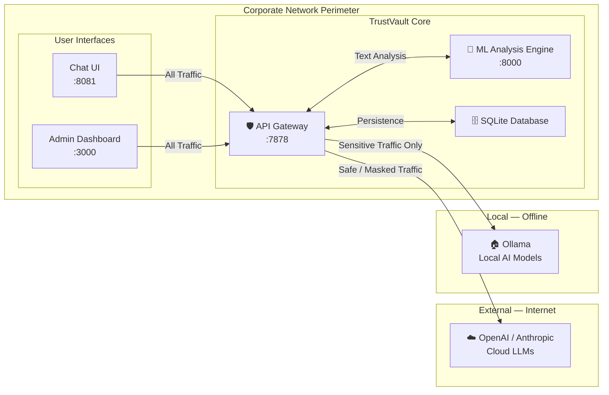
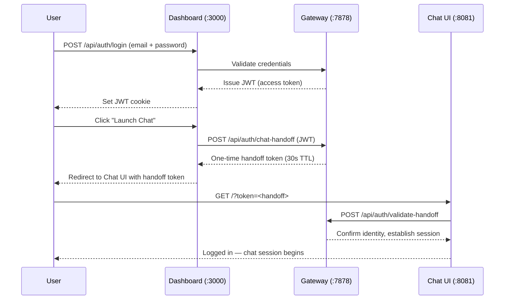
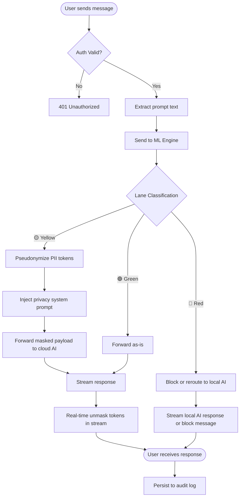
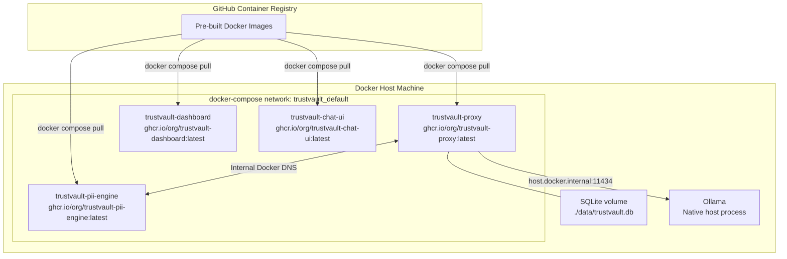

# TrustVault: System Architecture

> This document describes the high-level system architecture of TrustVault. No source code or implementation details are included.

---

## Architectural Overview

TrustVault is composed of four primary services, each running as an isolated Docker container, communicating over a private internal network.

---

## Component Descriptions

### 1. API Gateway (`:7878`)
The central control point. It is a fully OpenAI-compatible REST API endpoint. Any application that can speak to OpenAI can be instantly redirected through TrustVault with a single configuration change.

**Responsibilities:**
- Authenticating all inbound requests (JWT / API Key)
- Orchestrating the analysis pipeline for every prompt
- Enforcing lane-based routing decisions
- Proxying and streaming responses back to clients
- Managing conversation history and the in-memory token vault

### 2. ML Analysis Engine (`:8000`)
A stateless inference service that accepts raw text and returns a classification verdict and anonymized payload.

**Responsibilities:**
- Named Entity Recognition (NER) for PII detection
- Confidentiality scoring for code segments
- Multilingual text analysis
- Producing a structured anonymization mapping (token vault)

### 3. Admin Dashboard (`:3000`)
A Next.js web application providing full observability into the security gateway.

**Responsibilities:**
- Real-time display of security lane events
- API key issuance and management for corporate tenants
- Analytics and trend visualization

### 4. Chat UI (`:8081`)
A customized, production-ready AI chat interface pre-configured to route all traffic through the TrustVault gateway.

---

## Authentication Flow

---

## Data Flow: Full Request Lifecycle

---

## Deployment Architecture

> **Zero Build Deployment:** Teammates pull pre-built images from GitHub Container Registry (GHCR). No Go compiler, Python environment, or Node.js installation is required on their machines.
